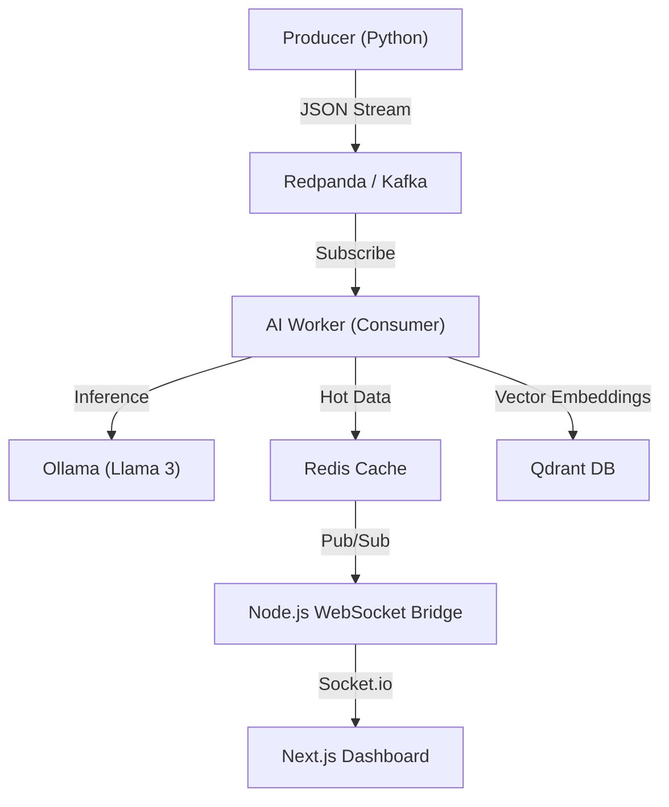

# PulseStream: Real-Time AI Market Intelligence

PulseStream is an event-driven, low-latency financial intelligence platform. It ingests simulated market news streams, processes them in real-time using **Llama 3** for sentiment analysis (Bullish/Bearish/Neutral), and indexes them into a Vector Database (**Qdrant**) for semantic search, while simultaneously pushing live updates to a client dashboard via **WebSockets**.

## 🏗 Architecture

The system follows a strict decoupling between Ingestion, Processing, and Presentation:


## 🛠 Tech Stack (The "Why")
- Redpanda (Kafka): Chosen for high-throughput event streaming without the JVM heaviness of Apache Kafka. Handles the data "nervous system."

- Ollama (Llama 3): Local LLM inference. Quantized 8B parameter model acting as the financial analyst.

- Redis: In-memory caching for sub-millisecond dashboard updates and Pub/Sub messaging to bridge the backend-frontend air gap.

- Qdrant: Vector Database. Stores news headlines as high-dimensional vectors (4096d) to enable semantic search (e.g., "Find past news about crypto crashes").

- Next.js 14 + Shadcn UI: Modern React framework for a high-performance, server-rendered dashboard.

- Docker Compose: Orchestrates the multi-container environment (5 services).

## 🚀 Quick Start
### Prerequisites
 Docker & Docker Compose

 Python 3.10+

 Node.js 18+

1. Infrastructure (The Plumbing)
Spin up the containerized services (Redpanda, Redis, Qdrant, Ollama):

```Bash

docker-compose up -d
Note: The first run requires pulling the Llama 3 model (~4GB). Run docker exec -it pulsestream-ollama ollama pull llama3.
```
2. The Backend (The Brain)
```Bash

cd backend
python -m venv venv
source venv/bin/activate
pip install -r requirements.txt

# Terminal A: Start generating market data
python producer.py

# Terminal B: Start the AI Analyst
python consumer.py
```
3. The Frontend (The Face)
```Bash

cd frontend
npm install

# Terminal C: Start the WebSocket Bridge
node server-bridge.js

# Terminal D: Start the UI
npm run dev
```
## 🔮 Roadmap
- Scaling: Implement a consumer group of 5 workers to parallelize inference.

- RAG (Retrieval-Augmented Generation): Use Qdrant to fetch historical context before analyzing new headlines.

- Kubernetes: Write Helm charts for deployment to a k8s cluster.


---