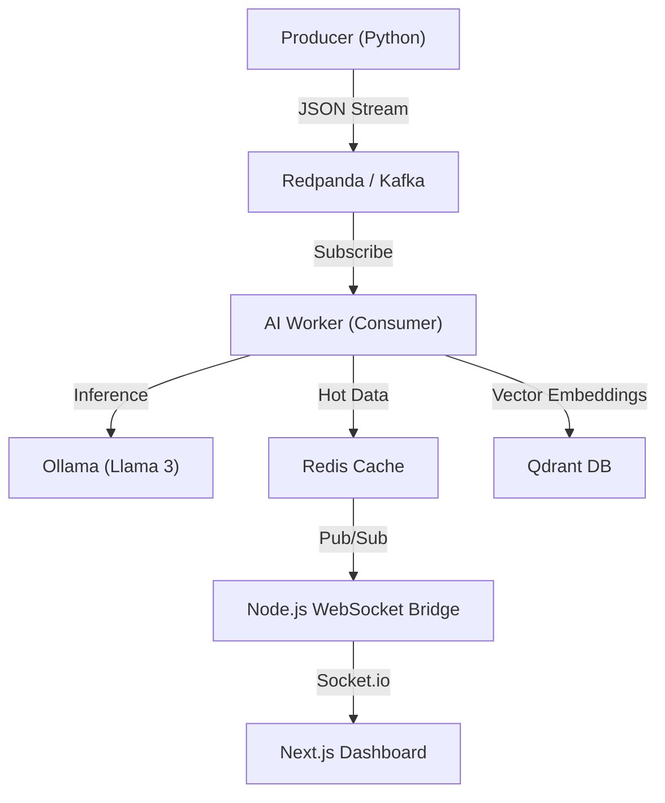

# PulseStream: Real-Time AI Market Intelligence

PulseStream is an event-driven, low-latency financial intelligence platform. It ingests simulated market news streams, processes them in real-time using **Llama 3** for sentiment analysis (Bullish/Bearish/Neutral), and indexes them into a Vector Database (**Qdrant**) for semantic search, while simultaneously pushing live updates to a client dashboard via **WebSockets**.

## 🏗 Architecture

The system follows a strict decoupling between Ingestion, Processing, and Presentation:


## 🛠 Tech Stack (The "Why")
- Redpanda (Kafka): Chosen for high-throughput event streaming without the JVM heaviness of Apache Kafka. Handles the data "nervous system."

- Ollama (Llama 3): Local LLM inference. Quantized 8B parameter model acting as the financial analyst.

- Redis: In-memory caching for sub-millisecond dashboard updates and Pub/Sub messaging to bridge the backend-frontend air gap.

- Qdrant: Vector Database. Stores news headlines as high-dimensional vectors (4096d) to enable semantic search (e.g., "Find past news about crypto crashes").

- Next.js 14 + Shadcn UI: Modern React framework for a high-performance, server-rendered dashboard.

- Docker Compose: Orchestrates the multi-container environment (7 services).

## 🚀 Quick Start
### Prerequisites
 - Docker & Docker Compose

 - Node.js 18+

1. The Backend (Fully Containerized)
We use Docker to spin up the entire data pipeline, including the AI model, database, and Python workers.

```Bash
# Start all 7 services (Redpanda, Redis, Qdrant, Ollama, Producer, Consumer)
docker-compose up -d
```
Note: The first run requires pulling the Llama 3 model. You may need to run this command once the Ollama container is active:
```Bash
docker exec -it pulsestream-ollama ollama pull llama3
```
2. The Frontend (The Face)
The frontend consists of a WebSocket bridge (to talk to Redis) and the Next.js UI.
```Bash
cd frontend
npm install

# Terminal A: Start the WebSocket Bridge
node server-bridge.js

# Terminal B: Start the UI
npm run dev
```
3. Verification
- Open http://localhost:3000 to see the live market feed.
- View logs for the AI analyst:
```Bash
docker logs -f pulsestream-consumer
```
## 🔮 Roadmap
- Visualizing Vectors: Integrate Qdrant dashboard for embedding visualization.

- RAG (Retrieval-Augmented Generation): Use Qdrant to fetch historical context before analyzing new headlines.

- Kubernetes: Write Helm charts for deployment to a k8s cluster.


---